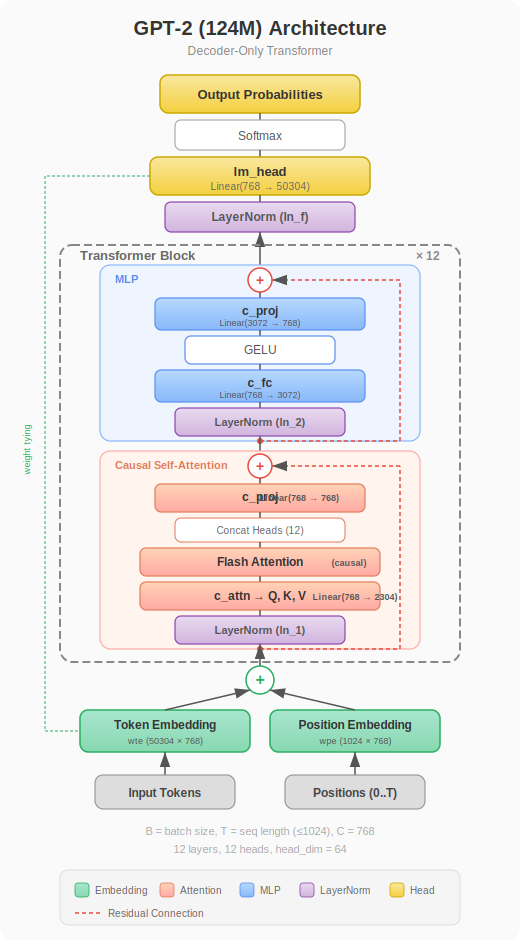

# nanoGPT revisit

Watched [Andrej Karpathy's video](https://www.youtube.com/watch?v=l8pRSuU81PU) on GPT2 from 2024 again.
(Great video, definitely worth 4 hours)

This repo is looking to:
- Replicate the core code of GPT2 and training process
- Implement and evaluate newer techniques, such as:
    - RoPE (Rotary Position Embedding)
    - MoE (Mixture of Experts)
    - RMSNorm (Root Mean Square Normalization)
    - ... and more we shall see.
- Explore AI compilation pipeline in `torch.compile`
    - Inductor
    - Triton
    - MLIR
    - ... and more

## GPT2 - decoder only transformer

### Architecture



### Weights visualization


## Additional notes

1. **Datatype used in training**: WIP

2. **Training time measurement**: 

`time.time()` and `torch.cuda.Event()` have comparable accuracy.

3. **Throughput: tokens per second**:

The difference b/w Ampere (A100 in the video) and Ada Lovelace (RTX 4090)
    a. RTX 4090 has 24GB VRAM, while A100 has 40GB or 80GB VRAM
        - This means I can only train batch size of 8 and sequence length of 1024
        - A100 can train batch size of 16 (in the video) (more is possible)

RTX 4090
| Method / Optimization | Time | Tokens/sec | Throughput | Notes |
|---|---|---|---|---|
| vanila code | 315 ms | 26000 tokens/sec | 0x | |
| `torch.set_float32_matmul_precision('high')` | 260 ms | 31300 tokens/sec | 1.2x | |
| `with torch.autocast(device_type=device, dtype=torch.bfloat16):` | 200 ms | 40800 tokens/sec | 1.5x | |
| `torch.compile(model)` | 220 ms | 37300 tokens/sec | 1.4x | |
| `torch.compile(model) + torch.autocast` | 100 ms | 81000 tokens/sec | 3.1x | |
| `+F.scaled_dot_product_attention(q, k, v, is_causal=True)` | 72 ms | 113000 tokens/sec | 4.3x | still no pattern match |
| `+vocab_size: int = 50304` | 72 ms | 113000 tokens/sec | n/a | no effect as of 202603 |
| `+fused AdamW` | 68 ms | 120000 tokens/sec | 4.6x | |


## Issues in replicating

1. **Weight tying inconsistent behavior**: 

```python
# Output: deterministic repetition of the last token
self.lm_head.weight = self.transformer.wte.weight

# Output: pure random gibberish
self.transformer.wte.weight = self.lm_head.weight
```

**Reasoning:**
- `nn.Embedding` (for `wte`) defaults to $\mathcal{N}(0, 1)$ initialization with a variance of `1.0`.
- `nn.Linear` (for `lm_head`) defaults to $\mathcal{U}(-\sqrt{k}, \sqrt{k})$ initialization with a tiny variance of `~0.0004` (for $d=768$).
- Because the script does not explicitly reset weights via a custom `_init_weights(std=0.02)` function, the pointer assignment determines the final magnitude of the token embeddings:
  - **`lm_head = wte`**: The token embeddings keep their massive 1.0 variance. They dominate the additions in the Transformer's residual stream. The final inner product at the tied `lm_head` computes the dot product of the token embedding against itself, yielding a huge logit (~768). The softmax outputs `1.0` probability for exactly the same token, causing infinite repetition.
  - **`wte = lm_head`**: The token embeddings take on the tiny 0.0004 variance. At the input `x = tok_emb + pos_emb`, the token signal is utterly drowned by `wpe` (positional embeddings, which are still `nn.Embedding` at 1.0 variance). Without any token signal preserved, the logits at the output compute to near zero, decaying the softmax into a uniform random distribution and producing pure gibberish.


## Environment

- Python 3.12
- PyTorch 2.10.0
- CUDA 12.8
- GPU: NVIDIA GeForce RTX 4090

## Reference

- [NanoGPT](https://github.com/karpathy/nanogpt)
- [Video](https://www.youtube.com/watch?v=l8pRSuU81PU)